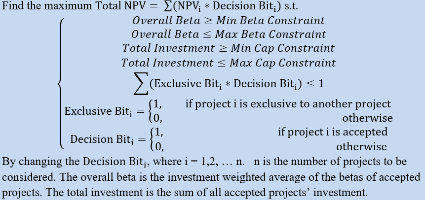
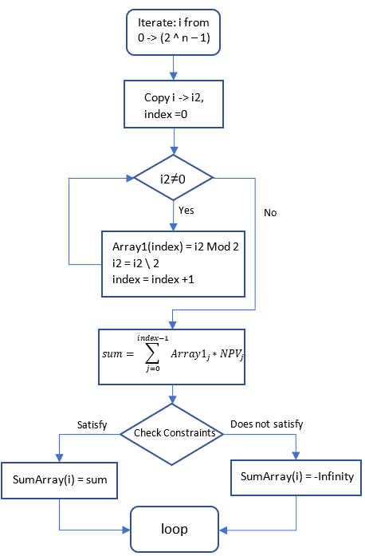
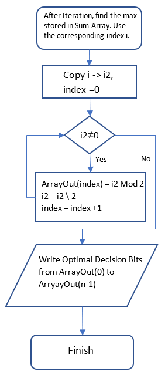

# Quick Solver

**Quick Solver** is an optimization algorithm which reduces enumeration time from 40-50 seconds to **less than 8 milliseconds**, which is more than **5000 times faster**.

In capital budgeting, there are a bunch of available projects for the company, and the manager wants to choose an optimal set of project which is the most profitable but also fulfills risk and capital constraints. This scenario is one of the [Integer Programming](https://en.wikipedia.org/wiki/Integer_programming) problems. In financial modeling, usually the optimization calculation is done using Excel Solver add-in with Evolutionary Algorithm. However, the Evolutionary Algorithm of Excel Solver takes a long time to run (40-50 seconds for 11 projects), and it does not always converge to global optimum.

The problem can be written as:

Compared with the Evolution Algorithm, the **Quick Solver** here is fundamentally an enumeration algorithm. However, it is much more interesting behind the scene.

The flow charts with pseudo codes:

**Step 1:**

**Step 2:**

## The key points in the algorithm

Since the Decision Bits are binary numbers, there are 2 ^ n  situations for n projects to be considered. For example, if there are 3 projects to be considered, then there will be 8 combinations of Decision Bits, from {0,0,0}, {0,0,1}... to {1,1,1}.

Each combination can be seen as one binary number. For example, 

1012 =510   1112=710

When the program iterates from i = 0 to (2 ^ n - 1), each time i is converted to one binary number,  and the digits of which are stored in Array1. Thus, array1 becomes a set of Decision Bits. Calculate the Total NPV by summing weighted average of NPV for each project, where the weights are the set of 1 or 0 Decision Bits, which represent accepted or not. Then the constraints of the model are checked in the program, including Mutually Exclusive constraints, Total Investment constraints, and Overall Beta constraints. If the constraints are satisfied, the sum (TotalNPV) will be recorded in a one-dimensional array SumArray. Otherwise, minus infinity will be recorded.

After iteration, find the max number stored in the SumArray because the user needs to maximize TotalNPV. There is no need to keep track of Decision Bits in the previous step, because converting the index to the maximum number in the SumArray will directly become the corresponding Decision Bits. This trick effectively saves both the program execution time and the memory space.

Then the Optimal Decision Bits will be written to the cells in the working area of the model (see the Excel file). In the main area of the model, the results under “Accept?” will change accordingly.

## Benchmark for the Quick Solver

The calculation time of the Quick Solver for 11 projects from the Factory Data Set is less than 5ms on average on an average computer. With the time of reading and writing to cells included, the total execution time is less than 100ms, compared to 40 seconds to more than 1 minute by using Excel Solver Add-in.
However, when the number of projects increases to more than 20, it becomes significantly difficult to enumerate all possible Total NPVs, because (2 ^ n  - 1) increases rapidly. It takes approximately 7.3 seconds to calculate 21 projects, and more than 145 seconds to calculate 25 projects. It can be observed
that when a certain number of projects is exceeded, the Excel will freeze and the user will not be able to
interrupt the calculation even using VBA debugger keyboard shortcut. So by default, the model will automatically run the Excel Solver Add-in instead, when there are more than 21 projects. However, it should be reminded that in such a problem, it might be hard to get a global optimum when using the Evolutionary
algorithm. 